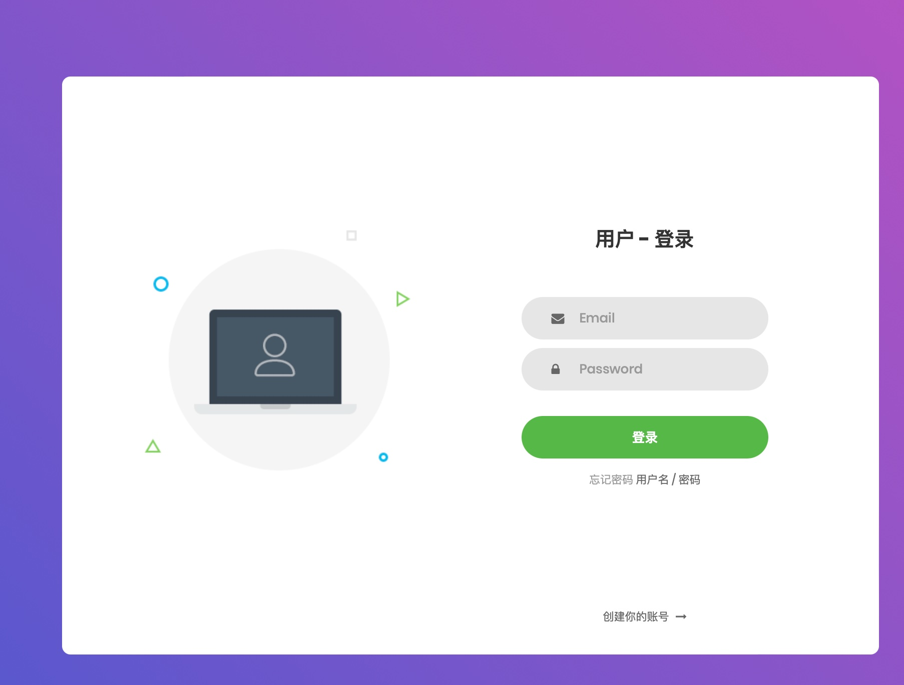
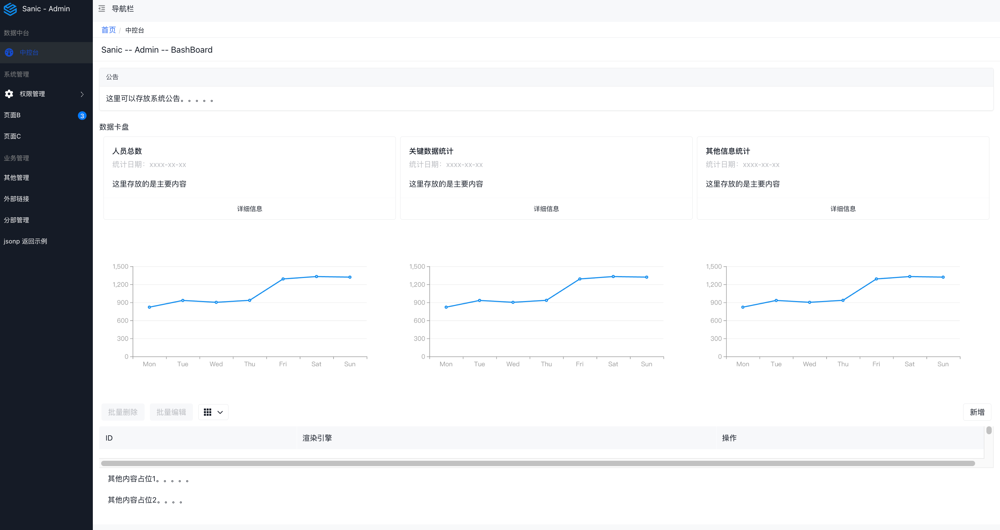
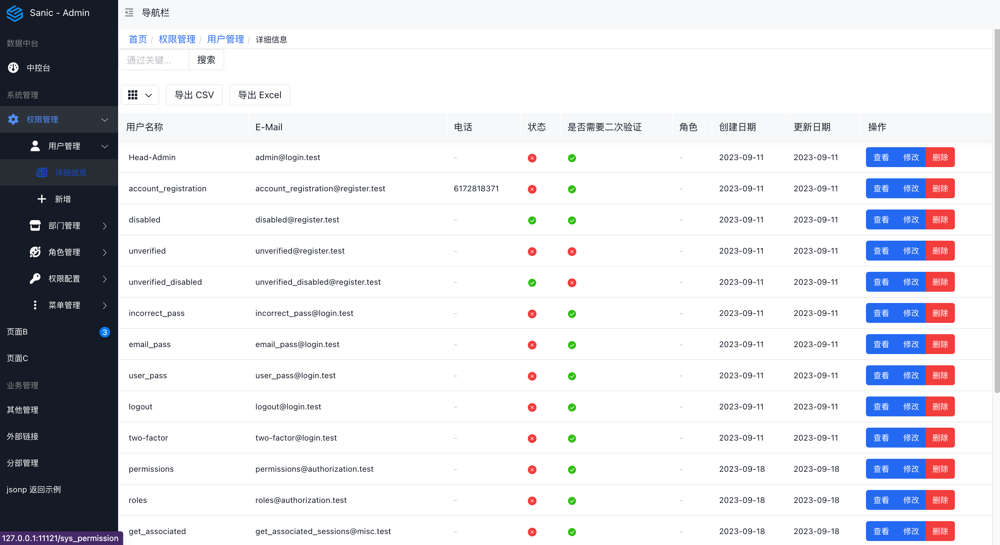
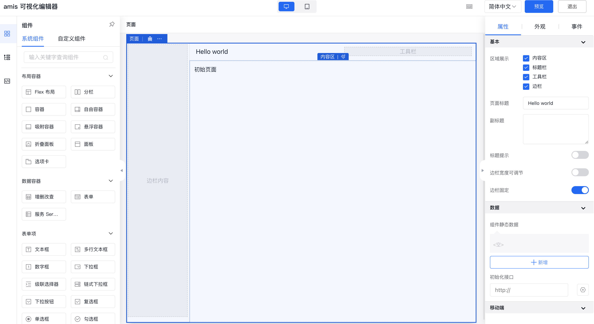
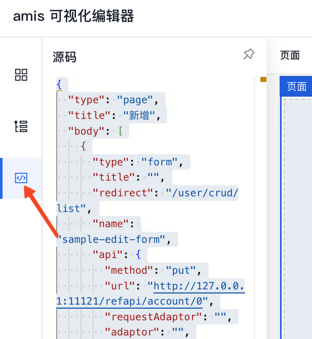

# SA-Admin

依赖 Sanic 为基础，利用了低代码框架 AMIS 来实现前端，便捷的解决了后端人员配置前端的麻烦，也通过 Sanic 的强大和轻便使得后端管理器可以覆盖更大的范围实现更强的功能。








## 安装


​	暂时还没有处理成可以痛殴pypi安装的方式，可以直接克隆到本地，直接运行

```python
python3 main.py
```

就可以运行调试。


## 使用

​		具体的使用，你需要有sanic或者flask的基础即可使用。大致的框架参考Djanog，使用的ORM是Tortoise，，使用的模版是Jinja2，前端框架是使用了百度的低代码框架Amis，这是一个十分便捷的前端框架，不过你需要一点时间去熟悉它，这样你就可以直接通过Json来控制前端的页面。

​		代码中都有使用注释，可以直接查看代码

具体的使用：

 1. 数据库配置

    数据库的配置在main.py中,如果需要换别的数据库，建议修改成Mysql或者PostgreSQL,因为Tortoise是直接支持这2个数据库的异步调用的，速度真的没多说。

    ```
    sa_config.TEST_DATABASE_URL = "sqlite://security_test_db.sqlite3"
    ```

    

    

 2. 管理员配置

    管理员的初始密码是 SAdmin ： SAdmin@123

    如果需要修改成自己的密码，请修改参数

    ```
    sa_config.INITIAL_ADMIN_PASSWORD = "SAdmin@123"  # 创建初始管理员帐户时使用的密码
    ```

    

 3. 配置端口，运行命令

    如有需要请自行更改端口

    ```
        app.run(host="127.0.0.1",
                port=22222,
                workers=1,
                debug=True,
                auto_reload=True)
    ```

    命令说明：

    ​	worker=1 , 这个是配置多任务处理的，但是在高并发的情况下，因为并行和异步切换的耗时，比单独的1个单实例更慢，所以如果有需要的，建议开多个进程，暂时别使用workers，但是具体还是需要根据实际场景。

      auto_reload=True ，是自动重载，这个真心好用。修改了代码不用手动重载

 4. 通过编辑器设计前端Amis

​	对于第一次接触Amis，还是慢慢的去看下Amis的介绍和使用方法，我当时也用了3天去看文档和了解各个部件的使用

然后就可以直接使用Amis的在线编辑来进行界面编辑了。

Amis编辑器：

https://aisuda.github.io/amis-editor-demo/#/hello-world



5. 编辑好前端控件，直接点击代码部分复制。

   

6. 去前端代码区，创建json文件，然后把代码复制进去。

   7. 主框架对新建代码部分进行引用。

      主框架文件是./admin/pages/site.json

      修改和引用方法：

      ​        直接把整个主框架代码复制，然后去Amis编辑器中，新建一个页面，粘贴进去，然后按照自己喜好，增加1个栏目

      ，编辑好后，再次复制到site.json中。把data部分，修改成  "schema":{},  // 这里的内容是右侧页面的内容

也可以直接参考我的做法，把新增加页面的内容另存为一个json文件，然后通过schemaApi去引用。具体请参考site.json文件的方法，

下面是Amis的json格式。

```
{
  "status": 0,	//返回必须项目
  "msg": "",		//	返回必须项
  "data": {			// 返回的就是页面元素的JSON
    "pages": [
      {	//	导航栏的标题层
        "label": "Home",
        "url": "/", // 代表这一层的url，方便其他层级跳转
        "redirect": "/login" // 页面初始化的时候定位到什么页面
      },
      {
        "label": "功能导航",		//	 这一层开始就是导航栏了
        "children": [					//	  导航栏的栏目层
          {
            "label": "登录/注册",
            "url": "login",
          	"schema":{},  // 这里的内容是右侧页面的内容
          },
          {
            "label": "这里有多少个，就代表导航栏有多少个栏目",
            "url": "login",
          	"schema":{},  // 这里的内容是右侧页面的内容
          }
        ]
      }
    ]
  }
}
```


## 最后说明：

​       这是一个简单的Admin管理界面，请按照你的具体需求进行修改，根据amis的特性，大致可以满足admin管理界面的90%的需求的，其他的还需要前端ui进行协助。

###  性能说明：

​        使用了ApiPost7进行测试，但是效果不想别人说的那么理想，估计是开了多个worker的问题，

​        自己写了个60秒的异步请求测试[./test/access_url.pu]，大概的一个进程的访问量是20000～26000左右，返回结果是没有丢包的，大概请求的速率是400/S，在Sanic的处理下是完全没问题的。

当我开了3个进程同时进行，数量维持也是24000左右，结果也是完全没有报错，


当我开了10个进程，能同时处理的数量就下降到14000左右，不知道我是的手提电脑的资源限制「Macbook14 M1」还是怎样？如果有资源的你们可以使用我的代码，或者对其进行改进后再次进行测试。平均下来也是2300/S的压力负载，对于一个管理后台我觉得还是挺好的。


